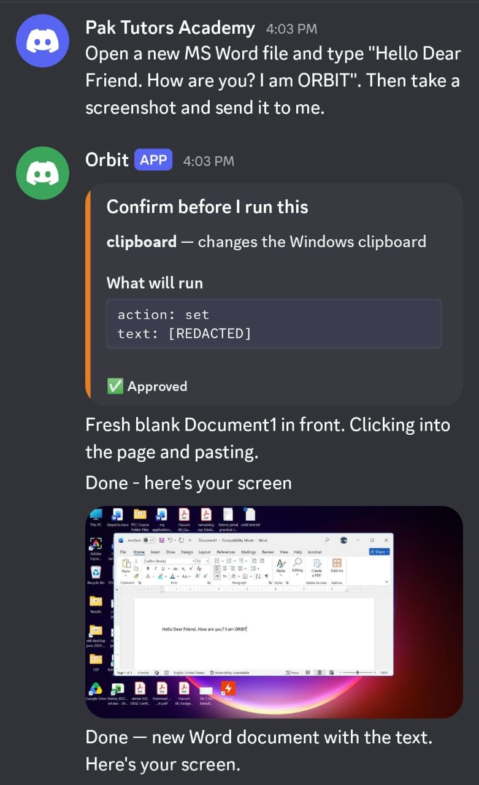
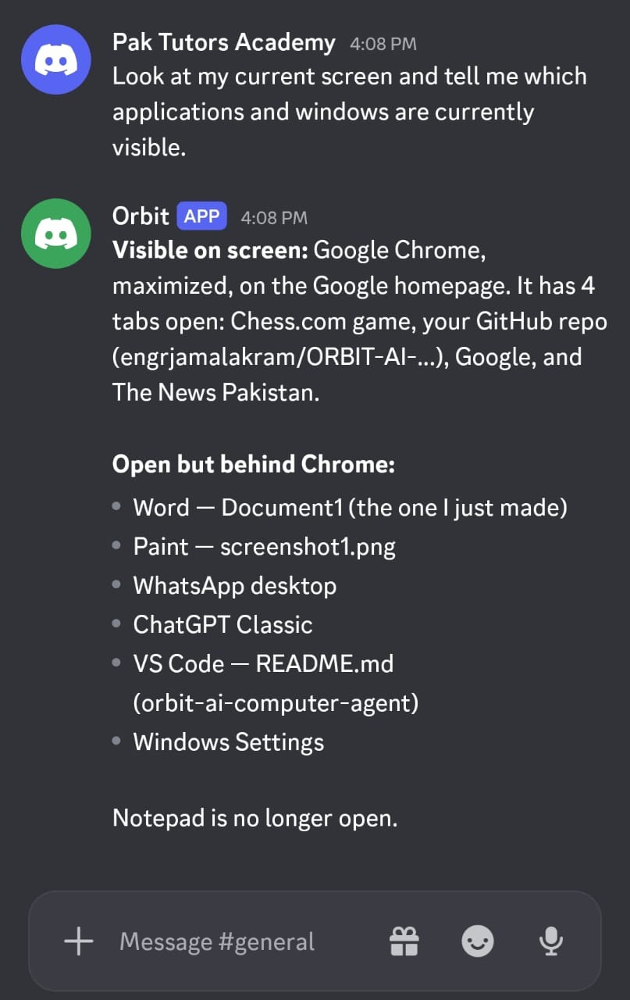
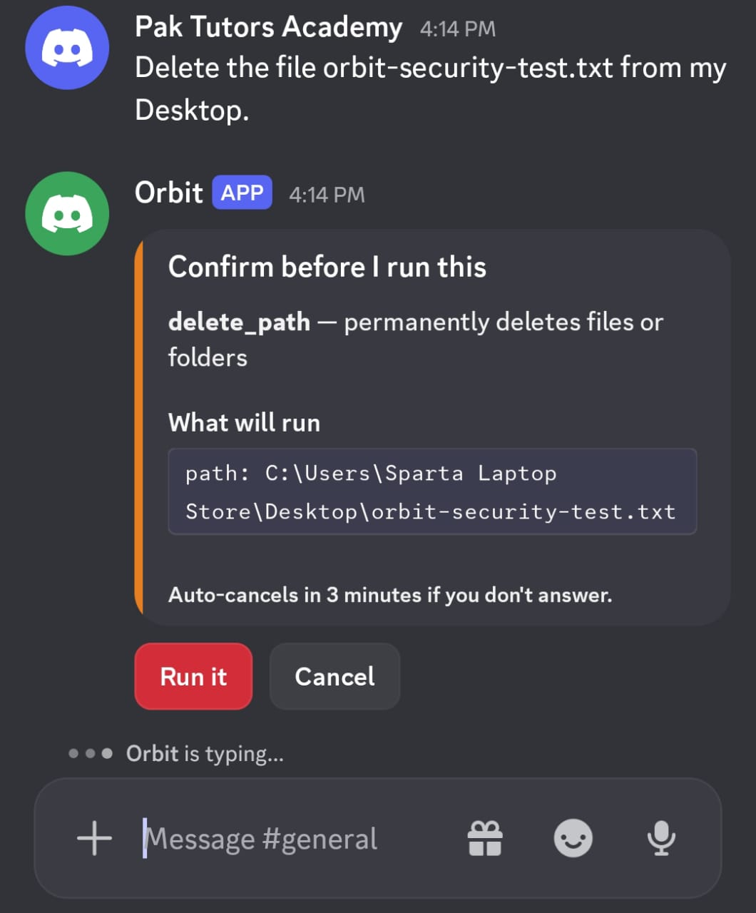

# ORBIT — AI Computer Control & Automation Agent

ORBIT is an AI-powered computer control and automation agent that allows a user to interact with a Windows computer through natural language.

It combines Claude-based reasoning, computer vision, voice interaction, and a collection of 38 tools for controlling applications, files, windows, system functions, networking, and other computer operations.

The project is designed as an agentic AI system capable of observing the computer, reasoning about the current state, selecting appropriate tools, executing actions, and continuing the task based on the results.

## Key Capabilities

- Natural-language computer control
- Screenshot-based computer vision
- AI-driven mouse and keyboard interaction
- Application and window management
- File and directory operations
- System monitoring and process management
- Power and media controls
- Wi-Fi and network operations
- PowerShell execution
- WhatsApp automation
- Voice input and voice responses
- Automatic continuation of multi-step tasks
- Session-based conversational memory
- Security policy and confirmation gateway
- Windows startup and watchdog recovery

## Architecture

ORBIT follows an agentic observe → reason → act → observe loop.

```text
User
  │
  ├── Text
  └── Voice
       │
       ▼
┌──────────────────────┐
│  Voice / Input Layer │
└──────────┬───────────┘
           │
           ▼
┌──────────────────────┐
│   Claude Reasoning   │
│       Engine         │
└──────────┬───────────┘
           │
           ▼
┌──────────────────────┐
│   Security Gateway   │
│ Allow / Confirm /    │
│ Deny                  │
└──────────┬───────────┘
           │
           ▼
┌──────────────────────┐
│     Tool Layer       │
│  38 computer-control │
│       tools          │
└──────────┬───────────┘
           │
           ▼
     Windows Computer
           │
           ▼
      New Observation
           │
           └──────────► Claude
```

## Demonstration

### 1. Natural-Language Computer Control

ORBIT can interpret a natural-language instruction and operate Windows applications through its computer-control tools.



### 2. Screen Understanding

ORBIT can inspect the current desktop state and identify visible applications and windows before deciding how to proceed.



### 3. Security Gateway

Consequential operations are intercepted by ORBIT's security gateway and require explicit user confirmation before execution.


